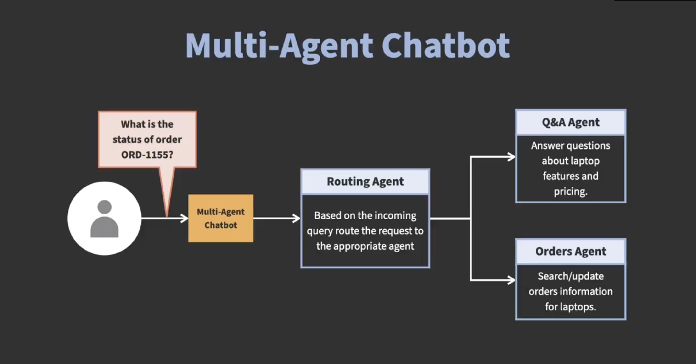
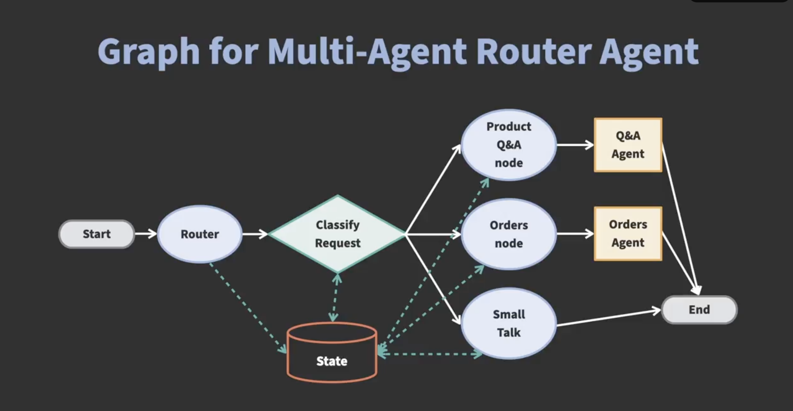

# 🤖 Multi-Agent System with LangGraph — Agentic AI Apps

This branch implements a **multi-agent chatbot system** using **LangGraph / LangChain** 
that dynamically routes user requests to one of multiple specialized agents:

- **Product Agent** — handles product-related queries (e.g. “Show me laptops under $1000”).  
- **Orders Agent** — handles order queries and updates (e.g. “What is order ORD-7311?”).  
- **Small Talk Agent** — handles general chit-chat or fallback conversations.

The core logic is in the notebook: [`multi-agent-system-with-langgraph.ipynb`](multi-agent-system-with-langgraph.ipynb)

This architecture demonstrates how to build an orchestrator that analyzes user intent 
and dispatches to the correct agent — enhancing modularity, maintainability, 
and specialization.



---

## 📁 Project Structure
```
.
├── agentic_ai_apps/
│ └── data/
│     └── Laptop Orders.csv
│     └── Laptop Pricing.csv
│     └── Laptop product descriptions.pdf
├── images/
│     └── multi_agent_system.png
│     └── graph_for_summarizer_agent.png
├── .env
├── .gitignore
├── multi-agent-system-with-langgraph.ipynb
├── README.md
```

---

## ⚙️ Installation

### 1. Clone the repository

```bash
git clone git@github.com:rebase-master/agentic-ai-apps.git
cd agentic-ai-apps
```

### 2. Checkout the relevant branch
```bash
git checkout multi-agent-systems-with-langgraph
```
### 3. Create a virtual environment
```bash
# Create a virtual environment
python3 -m venv jupyter_env

# Activate it
source jupyter_env/bin/activate      # macOS/Linux
venv\Scripts\activate                # Windows

# Install jupyter
pip install jupyter
```

### 4. Configure environment variables
```bash
export OPENAI_API_KEY="your_openai_api_key"
```

### 5. Run the notebook
```bash
jupyter notebook
```

---

## 🧩 How It Works (Theory & Design)



### 🧭 Agent Orchestration & Routing

This system implements a **routing layer (orchestrator / dispatcher agent)** that:

1. **Analyzes user input** to detect the intent domain (Product, Order, or Small Talk).  
2. **Dispatches** the request to the appropriate agent module.  
3. **Aggregates** or **formats** the response before returning it to the user.

This architecture allows each agent to specialize in its own domain, making the system **modular**, **extensible**, and **easier to maintain**.

---

### 🕸 LangGraph & Workflow Graph

- The orchestrator and agents are modeled using **LangGraph**, where nodes represent decision points, tool invocations, or fallback logic.  
- The workflow supports **branching logic**, **error handling**, and **fallbacks** (e.g., routing to the Small Talk agent if no clear intent is found).  
- Each agent defines its own **subgraph** consisting of tool calls, validations, and response formatting. The orchestrator routes requests into these subgraphs dynamically.

---

### 🤖 Agents & Tools

#### 🛍 Product Agent
- Handles **product searches, recommendations, and filtering**.  
- Uses product APIs or internal catalogs via its tool module (e.g., `product_tools`).  

#### 📦 Orders Agent
- Manages **order-related queries and updates**.  
- Interacts with databases or order management systems via secure tools  
  (e.g., `orders_tools.get_order_details`, `orders_tools.update_quantity`).  

#### 💬 Small Talk Agent
- A **fallback conversational agent** for general dialogue or when input is out of scope.  
- Ensures the chatbot remains engaging even for non-domain requests.

The orchestrator determines which sub-agent’s tools to call based on input analysis, then routes and merges their responses.

---

### 🚀 Benefits & Extensibility

- **Separation of Concerns** — Each agent is independent and focused on a single domain.  
- **Scalable Routing** — Add more agents (e.g., inventory, billing, user profile) by plugging them into the orchestrator.  
- **Safe Interactions** — Actions (like database updates) occur only via predefined, secure tools.  
- **Customizable Flow** — Supports additional logic such as confirmation prompts, fallback agents, or human-in-the-loop approval steps.

---


### 🖼 Example Flow
| User Input                               | Determined Agent | Tool Called                     | Final Response                               |
| ---------------------------------------- | ---------------- | ------------------------------- | -------------------------------------------- |
| “Show me gaming laptops under ₹1,00,000” | Product Agent    | `product_search(...)`           | “Here are 5 gaming laptops …”                |
| “What is the status of order ORD-5678?”  | Orders Agent     | `get_order_details("ORD-5678")` | “Order ORD-5678: qty 2, status: Shipped”     |
| “Hi, how are you?”                       | Small Talk Agent | `reply_small_talk(...)`         | “I’m doing great! How can I help you today?” |


### 🔮 Future Enhancements

- Add agents for inventory, billing, or customer support.
- Implement policy-based routing (e.g. user priority, context-aware routing).
- Support agent chaining (e.g. product → order flow in one conversation).
- Introduce user authentication and context-aware sessions.
- Add logging, metrics, and debugging tools to monitor routing and agent performance.

### 🧾 License
This project follows the MIT License provided by the LinkedIn Learning repository.

### 📚 References
- Build AI Agents and Chatbots with LangGraph — [LinkedIn Learning Course](https://www.linkedin.com/learning/build-ai-agents-and-chatbots-with-langgraph)
- [LangGraph GitHub Repository](https://github.com/LinkedInLearning/build-ai-agents-and-chatbots-with-langgraph-2021112)
- [LangChain Documentation](https://python.langchain.com/docs/introduction/)


