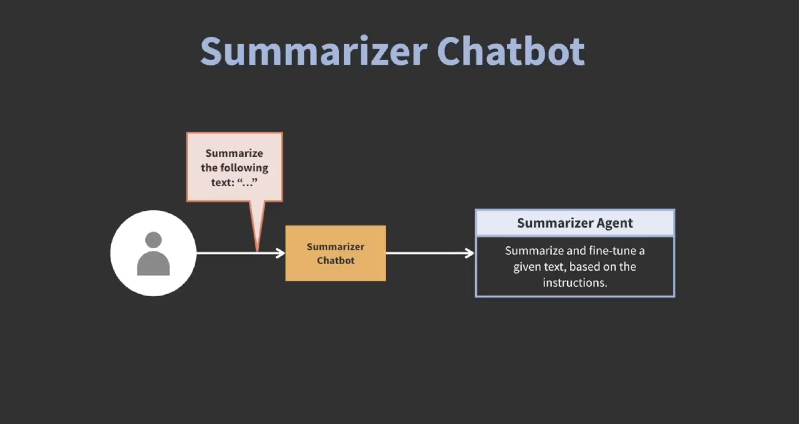
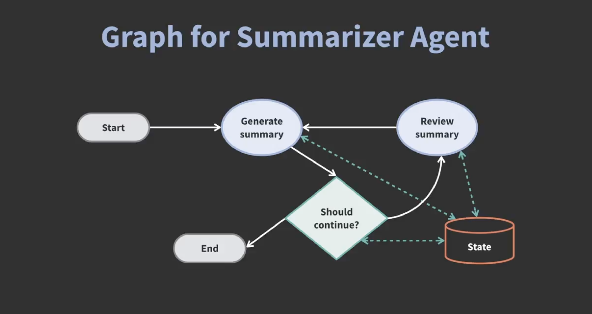

# 🧠 Summary Chatbot with Reviewer — Agentic AI Apps

This branch implements a **Summary Chatbot with Reviewer** using agentic AI techniques (LangGraph / LangChain) to not only summarize documents but also **review** or critique them.  
The core logic is contained in the Jupyter notebook:  
[`summary-chatbot-with-reviewer.ipynb`](summary-chatbot-with-reviewer.ipynb)

This extends the order-chatbot style example into a more nuanced 
summarization + review assistant.




---

## 📁 Project Structure
```
.
├── agentic_ai_apps/
│ └── data/
│     └── EcoSprint_Specification_Document.pdf
├── images/
│     └── summarizer_agent.png
│     └── graph_for_summarizer_agent.png
├── .env
├── .gitignore
├── summary-chatbot-with-reviewer.ipynb
├── README.md
```

---

## ⚙️ Installation

### 1. Clone the repository

```bash
git clone git@github.com:rebase-master/agentic-ai-apps.git
cd agentic-ai-apps
```

### 2. Checkout the relevant branch
```bash
git checkout summary-chatbot-with-reviewer
```
### 3. Create a virtual environment
```bash
# Create a virtual environment
python3 -m venv jupyter_env

# Activate it
source jupyter_env/bin/activate      # macOS/Linux
venv\Scripts\activate                # Windows

# Install jupyter
pip install jupyter
```

### 4. Configure environment variables
```bash
export OPENAI_API_KEY="your_openai_api_key"
```

### 5. Run the notebook
```bash
jupyter notebook
```

---

## 🧩 How It Works (Theory & Design)



### Agent + Tools Architecture

- The system is built as an agentic chatbot: a core agent receives user input, reasons about intent, and delegates to tool nodes (e.g. summarizer, reviewer).
- Tools isolate specialized logic (summarization, critique, validation) and interact with external APIs or modules safely.

### LangGraph State Graph Design

- Workflows are represented using LangGraph: each node is a step (parse, summarize, review, finalize).
- The graph can include branches: e.g. “If user requests critique → invoke review tool; else only summarize.”
- Graph edges manage transitions, looping, fallback in case of errors, etc.

### Summarization + Review Logic

- **Summarizer Tool:** Given a text or document, produce a concise summary.<br />
- **Reviewer Tool:** Take the summary (and original text) and provide feedback—e.g. missing points, logical inconsistencies, style issues.
- The agent can orchestrate sequences: first summarization, then review, then optionally revision.

### Safety, Modularity & Extensibility

- All operations on content are through defined tools, minimizing model hallucinations.
- To extend capabilities (e.g. include citations, sentiment analysis, rewriting), just add new tools and integrate them in the graph.
- You can also include human-in-the-loop checkpoints for high-stakes content review.

---

### 🖼 Example Flow
| User Input                                 | Agent Decision              | Tool Invoked                      | Output                                   |
| ------------------------------------------ | --------------------------- | --------------------------------- | ---------------------------------------- |
| “Summarize this document.”                 | Detect summarization intent | `summarizer_tool`                 | A concise summary of the text            |
| “Now review your summary.”                 | Detect review intent        | `review_tool`                     | Constructive critique of summary quality |
| “Refine the summary based on your review.” | Composite intent            | `summarizer_tool` + `review_tool` | Improved summary incorporating feedback  |


### 🔮 Future Enhancements

- Multi-document summarization and comparative reviews.
- Multiple reviewer personas (e.g., editorial, technical, critical).
- Integration with knowledge-grounded summarization (citations, references).
- Continuous learning feedback loop from user corrections.
- Web or API interface for real-world usage.

### 🧾 License
This project follows the MIT License provided by the LinkedIn Learning repository.

### 📚 References
- Build AI Agents and Chatbots with LangGraph — [LinkedIn Learning Course](https://www.linkedin.com/learning/build-ai-agents-and-chatbots-with-langgraph)
- [LangGraph GitHub Repository](https://github.com/LinkedInLearning/build-ai-agents-and-chatbots-with-langgraph-2021112)
- [LangChain Documentation](https://python.langchain.com/docs/introduction/)


