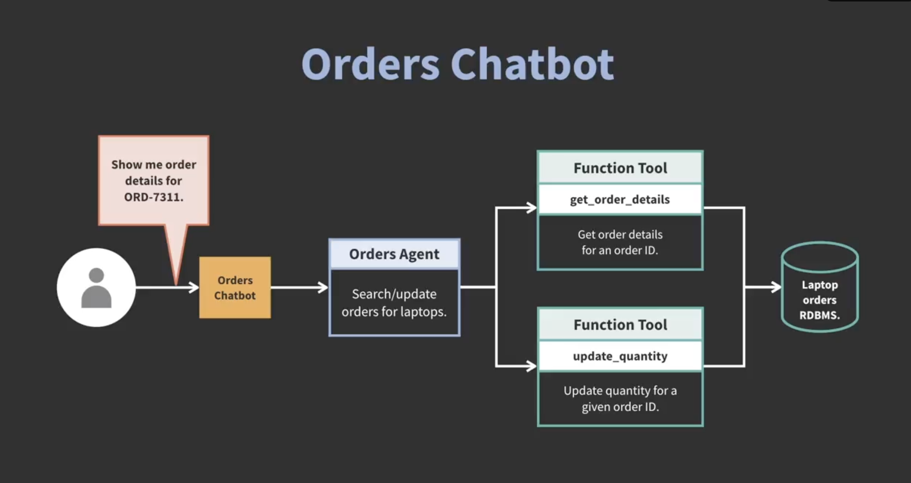

# 🛒 Orders Chatbot — LangGraph Custom Agent Example

This project implements an **Orders Chatbot** using **LangGraph** (built on LangChain) that can **retrieve** and **update** laptop order data via function calls and agent orchestration.




---

## 📁 Project Structure
```
.
├── agentic_ai_apps/
│ └── data/
│     └── Laptop Order.csv
├── images/
│     └── order_chatbot.png
├── .env
├── .gitignore
├── orders_chatbot_with_custom_agent-checkpoint.ipynb
├── README.md
```

---

## ⚙️ Installation

### 1. Clone the repository

```bash
git clone git@github.com:rebase-master/agentic-ai-apps.git
cd agentic-ai-apps
```

### 2. Checkout the relevant branch
```bash
git checkout orders-chatbot-with-custom-agent
```
### 3. Create a virtual environment
```bash
# Create a virtual environment
python3 -m venv jupyter_env

# Activate it
source jupyter_env/bin/activate      # macOS/Linux
venv\Scripts\activate                # Windows

# Install jupyter
pip install jupyter
```

### 4. Configure environment variables
```bash
export OPENAI_API_KEY="your_openai_api_key"
```

### 5. Run the notebook
```bash
jupyter notebook
```

---

## 🧠 How It Works
### 🔹 Overview
The chatbot allows users to search and update laptop orders through a natural-language interface.
When a user makes a request (e.g., “Show me order details for ORD-7311”), the chatbot interprets 
the intent and uses a custom agent built with LangGraph to execute structured operations via 
function calls. For data storage, an RDBMS can be used but for instructional purposes, Python Dataframes 
can also be used for quickly explaining the workflow.

### 🧩 Architecture
```sql
User → Orders Chatbot → Orders Agent → Function Tools → Laptop Orders RDBMS
```
### 🔧 Components
| Component               | Description                                                                                           |
| ----------------------- |-------------------------------------------------------------------------------------------------------|
| **Orders Chatbot**      | Main conversational interface handling user messages.                                                 |
| **Orders Agent**        | Interprets user intent and decides which function to call.                                            |
| **Function Tools**      | Implement structured operations like `get_order_details` and `update_quantity`.                       |
| **Laptop Orders RDBMS** | Database storing laptop order records OR use Python Dataframes <br/>for quick explanation of the concepts. |

### 🧩 Function Tools
| Function                              | Description                             | Parameters                       |
| ------------------------------------- | --------------------------------------- | -------------------------------- |
| `get_order_details(order_id)`         | Retrieves details for a specific order. | `order_id: str`                  |
| `update_quantity(order_id, quantity)` | Updates the quantity for an order.      | `order_id: str`, `quantity: int` |

---

## 🧠 Theory Behind the Chatbot

### 🕸 LangGraph Agent Design

- The Orders Agent is built using LangGraph, which represents workflows as state graphs.
- Each node in the graph represents a functional step (e.g., parse user input, call DB function, return response).
- Edges define transitions between nodes, enabling conditional flows, error handling, and loopbacks.

### 🧩 Agent + Tools Architecture

- The agent processes user queries and decides which tool function to execute.
- Tools are deterministic — they interact with external systems (like databases) in a safe, validated manner.
- This combination ensures that the model doesn’t hallucinate actions and only performs real operations through predefined APIs.

### 🔐 Safety & Extensibility

- All database access is isolated in the tools.py or db_client.py layer.
- Adding new actions (like canceling or tracking orders) is as simple as defining new functions and registering them with the agent.
- Optionally, human-in-the-loop nodes can be inserted for approval workflows.

### 🖼 Example Conversation
| User Input                           | Agent Action           | Tool Invoked                     | Response                                                   |
| ------------------------------------ | ---------------------- | -------------------------------- | ---------------------------------------------------------- |
| “Show me order details for ORD-7311” | Identify search intent | `get_order_details("ORD-7311")`  | “Order ORD-7311: Laptop Pro 15", Qty: 2, Status: Shipped.” |
| “Update that order to quantity 5”    | Identify update intent | `update_quantity("ORD-7311", 5)` | “Order ORD-7311 updated to quantity 5.”                    |

### 🔮 Future Enhancements

- Add support for multiple product categories.
- Integrate shipment and tracking APIs.
- Add authentication and user-based access control.
- Implement conversational memory for context retention.
- Extend the LangGraph workflow for more complex order management.

### 🧾 License
This project follows the MIT License provided by the LinkedIn Learning repository.

### 📚 References
- Build AI Agents and Chatbots with LangGraph — [LinkedIn Learning Course](https://www.linkedin.com/learning/build-ai-agents-and-chatbots-with-langgraph)
- [LangGraph GitHub Repository](https://github.com/LinkedInLearning/build-ai-agents-and-chatbots-with-langgraph-2021112)
- [LangChain Documentation](https://python.langchain.com/docs/introduction/)


